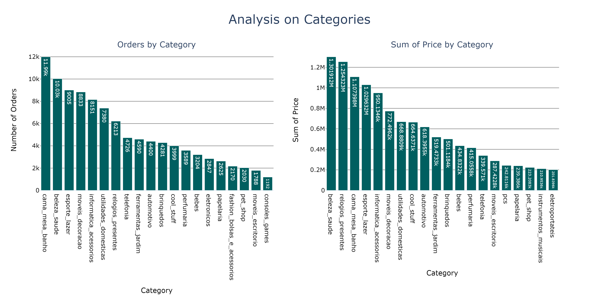
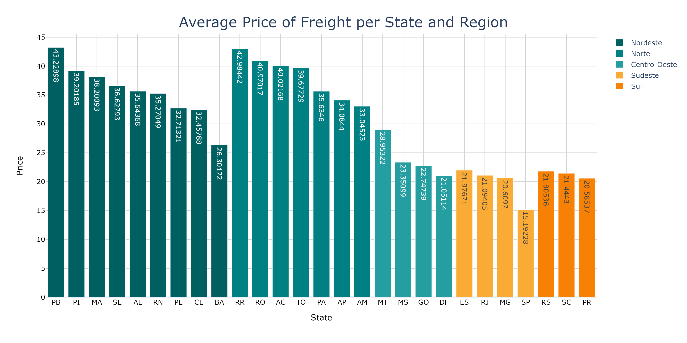
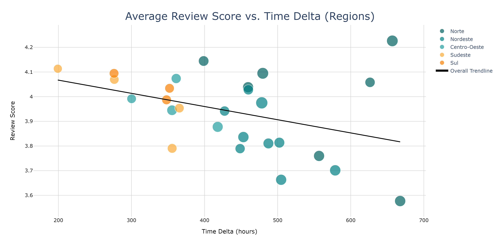

# Olist Exploratory Data Analysis with Pyplot

## About the Business
- Olist is a leading online e-commerce in Brazil, offering a diverse range of products through its platform.
- The company recognizes the importance of optimizing operational efficiency and the first step is to understand better customer behavior, orders variations,regional sales patterns, prices and freights variations through states, customer satisfaction and more.

## Objectives
- Creating a Exploratory Data Analysis (EDA) on Olist dataset with different topics about orders, products, customers, regions in order to provide quality information for strategic decision-making.

## Data Overview

| Column Name                | Description                          |
|----------------------------|--------------------------------------|
| `order_id`                 | Unique identifier for each order     |
| `order_item_id`            | Identifier for each item in an order |
| `price`                    | Price of the product                 |
| `freight_value`            | Cost of shipping                     |
| `product_id`               | Unique identifier for each product   |
| `product_category`         | Category of the product              |
| `payment_type`             | Type of payment used                 |
| `payment_value`            | Total payment for the order          |
| `installments`             | Number of installments for payment   |
| `review_score`             | Customer review score                |
| `order_status`             | Status of the order                  |
| `order_purchase`           | Date of order purchase               |
| `approved_at`              | Approval date and time               |
| `delivered_at_customer`    | Date and time of delivery to customer|
| `customer_id`              | Unique identifier for each customer  |
| `customer_city`            | City of the customer                 |
| `customer_state`           | State of the customer                |

## Solution Process

### **Imports:** 
- Importing libraries, setting configurations, helper functions and importing the dataset.

### **Data Description:** 
- Data description of the dataset, dimensions, columns and data types.

### **Data Preprocessing and Exploration:** 
- Setting up datetime variables and breaking them down into new columns (day, week, month, etc.), creating new columns (regions, days of the week), checking for missing values and outliers and exploring categorical and numerical data (mean, std, min, max, quantiles, etc.).

## **Exploratory Data Analysis** 
- Answering business questions about customer behavior, regional variations, pricing, freight variations, and customer satisfaction using **Pyplot**. Some examples are:

#### Analyzing Categories of Products

- Analysis on the 20 top selling categories;
- The second place on **Orders by Category**, beauty and health, is on the first place on **Sum of Price by Category** plot;
- The 7th place on **Orders by Category**, gifts watches, is on the second place on **Sum of Price by Category**, which means that they have a higher price per unit than the others.

#### Average Price of Freight per State and Region

- Beyond the high price for products, North and Northeastern states have the highest average price for freight as well;

- The lowest price for freight is in São Paulo State, probably because it's well structured logistics, unlike less populated states.

#### Average Review Score *vs.* Time Delta of Delivery by Regions

- São Paulo is the state with the shortest delivery time (199) but is not the one with the highest average score (4.11);

- At the other end, we have Amapá with the second longest delivery time (656) and the highest grade average (4.23);

- However, Roraima has the lowest average Review Score (3.58) for the longest delivery time (667);

- In general, it is possible to see that there is a negative relationship between the two variables, and it can be said that the longer the delivery time, the lower the average on Review Score.

## **Conclusions**

- In conclusion, this EDA on Olist dataset provides valuable insights into customer behavior, regional variations, pricing, freight variations, and customer satisfaction. 

- The findings offer a great amount of informations for strategic decision-making for the company, like:

> **1. Pricing and Financial Metrics:**
   - The average order price stands at **R$120**, with a considerable standard deviation of **R$184**, indicating a high variation in prices.
   - The freight values exhibit a mean of **R$20** and are subject to occasional outliers, with a maximum value of **R$409**.
   - The payment value, a combination of price and freight, averages around **R$172**, with a standard deviation of **R$267**. The dataset covers a wide range of purchase costs, with the highest reaching **R$13,664**.

> **2. Order Characteristics:**
   - The mean number of installments per order is 3, with a maximum of 24.
   - The average review score is 4, with a standard deviation of 1.4.
   - The dataset includes almost 100k unique orders and approximately 33k sold products across 74 different categories.
   - Each customer has only one recorded order, indicating a one-to-one mapping between orders and customers.

> **3. Temporal Trends:**
   - November 24, 2017, marked the peak in the number of orders, attributed to Black Friday, a renowned high-sales day.
   - Regionally, the Southeast consistently dominates in the number of orders throughout the year.

> **4. Payment Preferences:**
   - Credit cards are the overwhelmingly preferred payment method, followed by boleto, voucher, and debit cards.

> **5. Product Categories:**
   - `Bed, table and bath` emerges as the top-selling category, followed by `beauty and health` and `sports and leisure`.
   - The most lucrative categories are: `beauty and health`, `gifts watches` and `bed, table and bath`.

> **6. Geographical Patterns:**
   - São Paulo emerges as the leading buyer, significantly surpassing other states in the number of orders.
   - North and Northeastern states exhibit higher average prices and freight costs compared to South and Southeastern states.

> **7. Order Cancellations:**
   - Peak in order cancellations is observed around the 30th week, suggesting potential seasonal influences.

> **8. Customer Behavior:**
   - There is no clear monthly pattern in customer purchasing behavior, but a declining trend in the number of orders is evident after the 28th day.

> **9. Day-wise Patterns:**
   - Mondays witness the highest number of orders.
   - People buy less quantity and spend less money on weekends.
   - Thursdays seem to be associated with higher spending tendencies.

> **10. Delivery Time and Review Scores:**
   - There exists a negative relationship between delivery time and review scores, implying that longer delivery times may lead to lower satisfaction levels.

******
